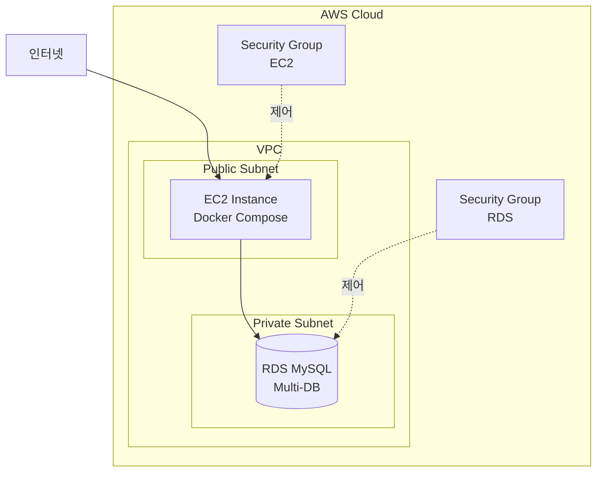

# AWS 배포 가이드 📦

HulaHoop 프로젝트를 AWS에 배포하는 상세 가이드입니다.

## 🎯 배포 아키텍처



## 📋 사전 준비사항

- AWS 계정
- AWS CLI 설치 및 구성
- SSH 키 페어
- 도메인 (선택사항)

## 1️⃣ RDS 데이터베이스 설정

### RDS 인스턴스 생성

1. **AWS RDS 콘솔** 접속
2. **데이터베이스 생성** 클릭
3. 다음 설정 사용:
   - **엔진**: MySQL 8.0
   - **템플릿**: 프리 티어 (또는 운영 환경에 맞게 선택)
   - **DB 인스턴스 크기**: db.t3.micro (프리 티어)
   - **스토리지**: 20GB (자동 확장 활성화)
   - **마스터 사용자 이름**: `root`
   - **마스터 암호**: 강력한 비밀번호 설정
   - **VPC**: 기본 VPC 또는 새로 생성
   - **퍼블릭 액세스**: 개발 중에는 예, 운영 환경에서는 아니오
   - **VPC 보안 그룹**: 새로 생성

### 보안 그룹 설정

RDS 보안 그룹에 다음 인바운드 규칙 추가:

| 유형 | 프로토콜 | 포트 | 소스 |
|------|---------|------|------|
| MySQL/Aurora | TCP | 3306 | EC2 보안 그룹 ID |

### 데이터베이스 생성

RDS 엔드포인트에 접속하여 데이터베이스 생성:

```bash
# MySQL 클라이언트로 접속
mysql -h your-rds-endpoint.rds.amazonaws.com -u root -p

# 데이터베이스 생성
CREATE DATABASE hulahoopdb CHARACTER SET utf8mb4 COLLATE utf8mb4_unicode_ci;
CREATE DATABASE cinemadb CHARACTER SET utf8mb4 COLLATE utf8mb4_unicode_ci;
CREATE DATABASE bikewaydb CHARACTER SET utf8mb4 COLLATE utf8mb4_unicode_ci;
```

### 연결 정보 저장

RDS 엔드포인트 주소를 메모:
```
your-instance-name.xxxxx.ap-northeast-2.rds.amazonaws.com
```

## 2️⃣ EC2 인스턴스 설정

### EC2 인스턴스 생성

1. **EC2 콘솔** 접속
2. **인스턴스 시작** 클릭
3. 다음 설정 사용:
   - **AMI**: Ubuntu Server 22.04 LTS
   - **인스턴스 유형**: t2.medium (최소) 또는 t3.medium (권장)
   - **스토리지**: 30GB 이상
   - **키 페어**: 기존 키 사용 또는 새로 생성
   - **네트워크**: RDS와 동일한 VPC

### EC2 보안 그룹 설정

다음 인바운드 규칙 추가:

| 유형 | 프로토콜 | 포트 | 소스 | 설명 |
|------|---------|------|------|------|
| SSH | TCP | 22 | My IP | SSH 접속 |
| Custom TCP | TCP | 8080 | 0.0.0.0/0 | API Gateway |
| Custom TCP | TCP | 5173 | 0.0.0.0/0 | Blue Frontend |
| Custom TCP | TCP | 3000 | 0.0.0.0/0 | Red Frontend |
| Custom TCP | TCP | 5175 | 0.0.0.0/0 | Cinema Frontend |
| Custom TCP | TCP | 5174 | 0.0.0.0/0 | Bike Frontend |

> ⚠️ **보안 경고**: 운영 환경에서는 로드 밸런서를 사용하고 직접 포트 노출을 최소화하세요.

### Swap 메모리 설정 (프리 티어/소형 인스턴스)

메모리가 부족한 경우 Swap 설정:

```bash
# Swap 파일 생성 (2GB)
sudo fallocate -l 2G /swapfile
sudo chmod 600 /swapfile
sudo mkswap /swapfile
sudo swapon /swapfile

# 영구 설정
echo '/swapfile none swap sw 0 0' | sudo tee -a /etc/fstab

# Swap 확인
sudo swapon --show
free -h
```

## 3️⃣ EC2에 Docker 설치

SSH로 EC2 인스턴스에 접속:

```bash
ssh -i your-key.pem ubuntu@your-ec2-public-ip
```

Docker 및 Docker Compose 설치:

```bash
# 시스템 업데이트
sudo apt update
sudo apt upgrade -y

# Docker 설치
sudo apt install -y apt-transport-https ca-certificates curl software-properties-common
curl -fsSL https://download.docker.com/linux/ubuntu/gpg | sudo gpg --dearmor -o /usr/share/keyrings/docker-archive-keyring.gpg
echo "deb [arch=$(dpkg --print-architecture) signed-by=/usr/share/keyrings/docker-archive-keyring.gpg] https://download.docker.com/linux/ubuntu $(lsb_release -cs) stable" | sudo tee /etc/apt/sources.list.d/docker.list > /dev/null
sudo apt update
sudo apt install -y docker-ce docker-ce-cli containerd.io

# Docker Compose 설치
sudo curl -L "https://github.com/docker/compose/releases/latest/download/docker-compose-$(uname -s)-$(uname -m)" -o /usr/local/bin/docker-compose
sudo chmod +x /usr/local/bin/docker-compose

# 현재 사용자를 docker 그룹에 추가
sudo usermod -aG docker $USER

# 재로그인 (또는 다음 명령 실행)
newgrp docker

# 설치 확인
docker --version
docker-compose --version
```

## 4️⃣ 프로젝트 배포

### 프로젝트 코드 가져오기

```bash
# Git 설치
sudo apt install -y git

# 프로젝트 클론
git clone https://github.com/your-username/your-repo.git
cd your-repo
```

### 환경 변수 설정

`.env` 파일 생성:

```bash
nano .env
```

다음 내용 입력:

```env
# 데이터베이스 설정 (RDS 엔드포인트 사용)
DB_URL=jdbc:mysql://your-rds-endpoint.rds.amazonaws.com:3306/hulahoopdb?useUnicode=true&characterEncoding=utf8&serverTimezone=Asia/Seoul
DB_USERNAME=root
DB_PASSWORD=your-rds-password

# 이메일 설정
MAIL_USERNAME=your-email@gmail.com
MAIL_PASSWORD=your-gmail-app-password

# API 키
GEMINI_API_KEY=your-gemini-api-key
KAKAO_API_KEY=your-kakao-api-key
TOSS_SECRET_KEY=your-toss-secret-key

# JWT 설정
JWT_SECRET=your-generated-jwt-secret
```

저장 후 종료 (`Ctrl+X`, `Y`, `Enter`)

### 애플리케이션 실행

```bash
# 이미지 빌드 및 컨테이너 실행
docker-compose up -d --build

# 로그 확인
docker-compose logs -f

# 서비스 상태 확인
docker-compose ps
```

### 자동 시작 설정

시스템 부팅 시 자동으로 서비스가 시작되도록 설정:

```bash
# Systemd 서비스 파일 생성
sudo nano /etc/systemd/system/hulahoop.service
```

다음 내용 입력:

```ini
[Unit]
Description=HulaHoop Docker Compose Application
Requires=docker.service
After=docker.service

[Service]
Type=oneshot
RemainAfterExit=yes
WorkingDirectory=/home/ubuntu/your-repo
ExecStart=/usr/local/bin/docker-compose up -d
ExecStop=/usr/local/bin/docker-compose down
TimeoutStartSec=0

[Install]
WantedBy=multi-user.target
```

서비스 활성화:

```bash
sudo systemctl enable hulahoop.service
sudo systemctl start hulahoop.service
sudo systemctl status hulahoop.service
```

## 5️⃣ 도메인 및 HTTPS 설정 (선택사항)

### Nginx 리버스 프록시 설치

```bash
sudo apt install -y nginx
```

Nginx 설정 파일 생성:

```bash
sudo nano /etc/nginx/sites-available/hulahoop
```

설정 내용:

```nginx
server {
    listen 80;
    server_name your-domain.com;

    # Blue Frontend
    location / {
        proxy_pass http://localhost:5173;
        proxy_http_version 1.1;
        proxy_set_header Upgrade $http_upgrade;
        proxy_set_header Connection 'upgrade';
        proxy_set_header Host $host;
        proxy_cache_bypass $http_upgrade;
    }

    # API Gateway
    location /api/ {
        proxy_pass http://localhost:8080;
        proxy_http_version 1.1;
        proxy_set_header Host $host;
        proxy_set_header X-Real-IP $remote_addr;
    }

    # 기타 서비스도 필요에 따라 추가
}
```

Nginx 활성화:

```bash
sudo ln -s /etc/nginx/sites-available/hulahoop /etc/nginx/sites-enabled/
sudo nginx -t
sudo systemctl restart nginx
```

### Let's Encrypt SSL 인증서 (HTTPS)

```bash
# Certbot 설치
sudo apt install -y certbot python3-certbot-nginx

# SSL 인증서 발급
sudo certbot --nginx -d your-domain.com

# 자동 갱신 설정
sudo systemctl enable certbot.timer
```

## 6️⃣ 모니터링 및 관리

### 로그 확인

```bash
# 모든 서비스 로그
docker-compose logs -f

# 특정 서비스 로그
docker-compose logs -f blue-back

# 최근 100줄만 보기
docker-compose logs --tail=100 -f
```

### 서비스 재시작

```bash
# 특정 서비스 재시작
docker-compose restart blue-back

# 모든 서비스 재시작
docker-compose restart

# 서비스 중지
docker-compose down

# 서비스 시작
docker-compose up -d
```

### 업데이트 배포

```bash
# 코드 업데이트
git pull

# 재빌드 및 재시작
docker-compose down
docker-compose up -d --build
```

### 디스크 공간 정리

```bash
# 사용하지 않는 Docker 이미지/컨테이너 정리
docker system prune -a

# 디스크 사용량 확인
df -h
docker system df
```

## 🔒 보안 체크리스트

- [ ] RDS 퍼블릭 액세스 비활성화 (운영 환경)
- [ ] 강력한 데이터베이스 비밀번호 사용
- [ ] EC2 보안 그룹에서 불필요한 포트 차단
- [ ] SSH 포트를 특정 IP로 제한
- [ ] 정기적인 시스템 업데이트
- [ ] 로그 모니터링 설정
- [ ] 백업 자동화 설정
- [ ] HTTPS 사용 (Let's Encrypt)
- [ ] 환경 변수 파일 권한 제한 (`chmod 600 .env`)

## 💰 비용 최적화 팁

### 프리 티어 활용

- **EC2**: t2.micro (750시간/월 무료)
- **RDS**: db.t2.micro 또는 db.t3.micro (750시간/월 무료)
- **스토리지**: 20GB SSD (프리 티어 포함)

### 비용 절감

- 개발/테스트: 사용하지 않을 때 인스턴스 중지
- RDS: 프로덕션이 아닌 경우 단일 AZ 사용
- 로그: 오래된 로그 파일 정기적으로 삭제
- CloudWatch: 불필요한 메트릭 비활성화

## 🐛 트러블슈팅

### 메모리 부족 오류

```bash
# Swap 메모리 확인
free -h

# Docker 메모리 제한 확인
docker stats

# Java 힙 메모리 줄이기 (docker-compose.yml)
environment:
  - JAVA_TOOL_OPTIONS=-Xmx256m
```

### 데이터베이스 연결 실패

```bash
# RDS 보안 그룹 확인
# EC2에서 RDS 연결 테스트
mysql -h your-rds-endpoint -u root -p

# 환경 변수 확인
cat .env
```

### 컨테이너 시작 실패

```bash
# 상세 로그 확인
docker-compose logs service-name

# 컨테이너 재빌드
docker-compose up -d --build --force-recreate service-name
```

## 📊 성능 튜닝

### JVM 메모리 설정

`docker-compose.yml`에서 각 백엔드 서비스의 메모리 조정:

```yaml
environment:
  # 최소 인스턴스용
  - JAVA_TOOL_OPTIONS=-Xmx256m -Xms128m
  
  # 중형 인스턴스용
  - JAVA_TOOL_OPTIONS=-Xmx512m -Xms256m
```

### MySQL 성능 최적화

RDS 파라미터 그룹 설정:
- `max_connections`: 100-200
- `innodb_buffer_pool_size`: 인스턴스 메모리의 70%
- `query_cache_size`: 적절한 크기로 설정

## 📞 지원

배포 관련 문제가 있으시면 GitHub 이슈를 생성해 주세요.
