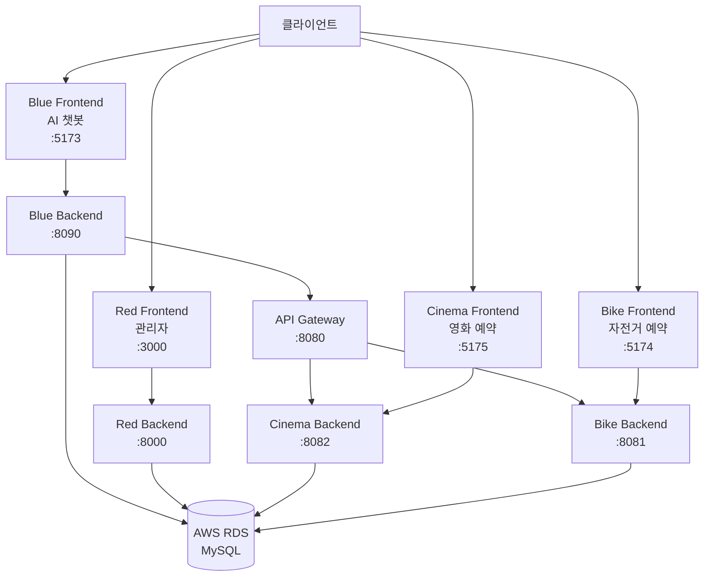

# HulaHoop 프로젝트 🎯

마이크로서비스 아키텍처 기반의 종합 예약 플랫폼

## 📋 프로젝트 개요

HulaHoop은 AI 챗봇을 통해 영화 예약과 자전거 예약을 통합 관리할 수 있는 마이크로서비스 기반 플랫폼입니다.

### 주요 기능

- 🤖 **AI 챗봇 통합 예약**: Gemini API 기반 자연어 처리로 간편한 예약
- 🎬 **영화 예약 시스템**: 좌석 선택, 결제, 예약 관리
- 🚴 **자전거 예약 시스템**: 자전거 대여 및 반납 관리
- 👤 **관리자 페이지**: 예약 현황 모니터링 및 통계
- 💳 **통합 결제**: Toss Payments 연동

## 🏗️ 아키텍처



## 🚀 빠른 시작

### 필수 요구사항

- Docker & Docker Compose
- Node.js 16+ (로컬 개발 시)
- Java 17+ (로컬 개발 시)
- MySQL 8.0+ (또는 AWS RDS)

### 1. 환경 변수 설정

`.env.example` 파일을 복사하여 `.env` 파일을 생성하고 실제 값을 입력하세요:

```bash
cp .env.example .env
# .env 파일을 편집하여 실제 값 입력
```

필수 환경 변수:
- `DB_URL`: MySQL 데이터베이스 연결 URL
- `DB_USERNAME`: 데이터베이스 사용자명
- `DB_PASSWORD`: 데이터베이스 비밀번호
- `GEMINI_API_KEY`: Google Gemini API 키
- `KAKAO_API_KEY`: Kakao REST API 키
- `TOSS_SECRET_KEY`: Toss Payments Secret 키
- `MAIL_USERNAME`: Gmail 계정
- `MAIL_PASSWORD`: Gmail 앱 비밀번호
- `JWT_SECRET`: JWT 서명 키 (256비트 이상)

### 2. Docker Compose로 실행

```bash
# 모든 서비스 빌드 및 실행
docker-compose up -d

# 로그 확인
docker-compose logs -f

# 특정 서비스만 재시작
docker-compose restart blue-back

# 모든 서비스 중지
docker-compose down
```

### 3. 서비스 접속

서비스가 정상적으로 시작되면 다음 주소로 접속할 수 있습니다:

| 서비스 | URL | 설명 |
|--------|-----|------|
| Blue (AI 챗봇) | http://localhost:5173 | AI 기반 통합 예약 플랫폼 |
| Red (관리자) | http://localhost:3000 | 관리자 대시보드 |
| Cinema (영화) | http://localhost:5175 | 영화 예약 서비스 |
| Bike (자전거) | http://localhost:5174 | 자전거 예약 서비스 |
| API Gateway | http://localhost:8080 | API 게이트웨이 |

## 📦 서비스 구성

### Blue Service (AI 챗봇)
- **Frontend**: Vite + React
- **Backend**: Spring Boot
- **주요 기능**: 
  - Gemini API 기반 자연어 처리
  - 통합 예약 인터페이스
  - JWT 인증
  - Kakao 로그인
  - 이메일 알림

### Red Service (관리자)
- **Frontend**: React
- **Backend**: Spring Boot
- **주요 기능**:
  - 예약 현황 모니터링
  - 통계 및 리포트
  - 회원 관리

### Cinema Service (영화 예약)
- **Frontend**: Vite + React
- **Backend**: Spring Boot
- **주요 기능**:
  - 영화 목록 및 상세 정보
  - 좌석 선택
  - 예약 및 결제
  - 예약 취소

### Bike Service (자전거 예약)
- **Frontend**: Vite + React
- **Backend**: Spring Boot
- **주요 기능**:
  - 자전거 목록
  - 예약 및 결제
  - 대여/반납 관리

### Gateway Service
- **기술**: Spring Cloud Gateway
- **주요 기능**:
  - 라우팅
  - 로드 밸런싱
  - 서비스 디스커버리

## 🛠️ 개발 환경 설정

### 프론트엔드 로컬 실행

```bash
# Blue Frontend
cd Blue-front
npm install
npm run dev

# Red Frontend
cd Red-front
npm install
npm run dev

# Cinema Frontend
cd NovaCinema-front
npm install
npm run dev

# Bike Frontend
cd Bikeway-front
npm install
npm run dev
```

### 백엔드 로컬 실행

각 백엔드 서비스에서 환경 변수를 설정한 후 실행:

```bash
# Blue Backend
cd Blue-back
./gradlew bootRun --args='--spring.profiles.active=docker'

# Red Backend
cd Red-back
./gradlew bootRun --args='--spring.profiles.active=docker'

# Cinema Backend
cd NovaCinema-back
./gradlew bootRun --args='--spring.profiles.active=docker'

# Bike Backend
cd Bikeway-back
./gradlew bootRun --args='--spring.profiles.active=docker'

# Gateway
cd Gateway
./gradlew bootRun --args='--spring.profiles.active=docker'
```

## 🔑 API 키 발급 방법

### Google Gemini API
1. [Google AI Studio](https://makersuite.google.com/app/apikey) 접속
2. API 키 생성
3. `.env` 파일의 `GEMINI_API_KEY`에 입력

### Kakao REST API
1. [Kakao Developers](https://developers.kakao.com/) 접속
2. 애플리케이션 생성
3. REST API 키 복사
4. `.env` 파일의 `KAKAO_API_KEY`에 입력

### Toss Payments
1. [Toss Payments 개발자센터](https://developers.tosspayments.com/) 접속
2. 계정 생성 및 앱 등록
3. Secret 키 발급
4. `.env` 파일의 `TOSS_SECRET_KEY`에 입력

### Gmail SMTP (앱 비밀번호)
1. [Google 계정 관리](https://myaccount.google.com/) 접속
2. 보안 > 2단계 인증 활성화
3. [앱 비밀번호 생성](https://myaccount.google.com/apppasswords)
4. `.env` 파일의 `MAIL_PASSWORD`에 입력

## 🗄️ 데이터베이스 설정

### AWS RDS 사용 (권장)

1. AWS RDS에서 MySQL 8.0 인스턴스 생성
2. 보안 그룹에서 3306 포트 허용
3. 데이터베이스 생성:
   ```sql
   CREATE DATABASE hulahoopdb CHARACTER SET utf8mb4 COLLATE utf8mb4_unicode_ci;
   CREATE DATABASE cinemadb CHARACTER SET utf8mb4 COLLATE utf8mb4_unicode_ci;
   CREATE DATABASE bikewaydb CHARACTER SET utf8mb4 COLLATE utf8mb4_unicode_ci;
   ```
4. `.env` 파일에 RDS 엔드포인트 정보 입력

### 로컬 MySQL 사용

```bash
# Docker로 MySQL 실행
docker run -d \
  --name mysql \
  -e MYSQL_ROOT_PASSWORD=root \
  -p 3306:3306 \
  mysql:8.0

# 데이터베이스 생성
docker exec -it mysql mysql -uroot -proot -e "
CREATE DATABASE hulahoopdb CHARACTER SET utf8mb4 COLLATE utf8mb4_unicode_ci;
CREATE DATABASE cinemadb CHARACTER SET utf8mb4 COLLATE utf8mb4_unicode_ci;
CREATE DATABASE bikewaydb CHARACTER SET utf8mb4 COLLATE utf8mb4_unicode_ci;
"
```

## 🔒 보안 주의사항

- `.env` 파일은 **절대 Git에 커밋하지 마세요**
- JWT Secret은 최소 256비트 이상의 안전한 키를 사용하세요
- 프로덕션 환경에서는 강력한 데이터베이스 비밀번호를 사용하세요
- API 키는 정기적으로 갱신하세요

## 🐛 트러블슈팅

### Docker 컨테이너가 시작되지 않을 때

```bash
# 로그 확인
docker-compose logs [service-name]

# 컨테이너 재시작
docker-compose restart [service-name]

# 완전히 재빌드
docker-compose down
docker-compose up --build
```

### 데이터베이스 연결 오류

1. `.env` 파일의 DB 정보가 올바른지 확인
2. MySQL 서버가 실행 중인지 확인
3. 방화벽/보안 그룹 설정 확인
4. 데이터베이스가 생성되었는지 확인

### API 키 오류

1. `.env` 파일이 올바른 위치에 있는지 확인
2. API 키가 유효한지 확인
3. API 키 권한 설정 확인

## 📝 라이선스

이 프로젝트는 MIT 라이선스 하에 배포됩니다.

## 👥 기여

이슈와 풀 리퀘스트는 언제나 환영합니다!

## 📧 문의

프로젝트 관련 문의사항이 있으시면 이슈를 생성해 주세요.
